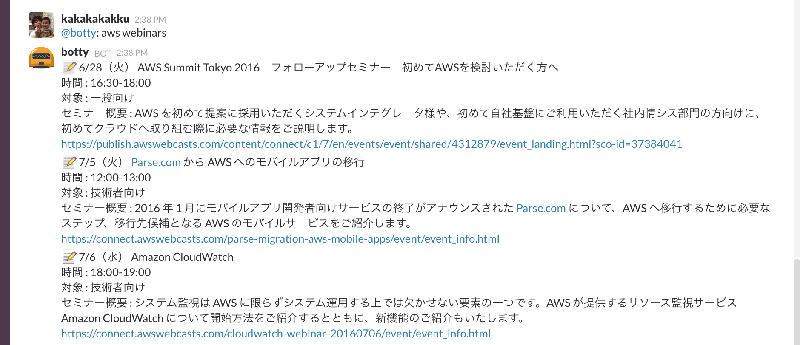

# hubot-aws-webinars

[](https://badge.fury.io/js/hubot-aws-webinars)

## Installation

```sh
$ npm install hubot-aws-webinars --save
```

After that, add `hubot-aws-webinars` to your `external-scripts.json`.

## Commands

* `aws webinars`

## Usage


